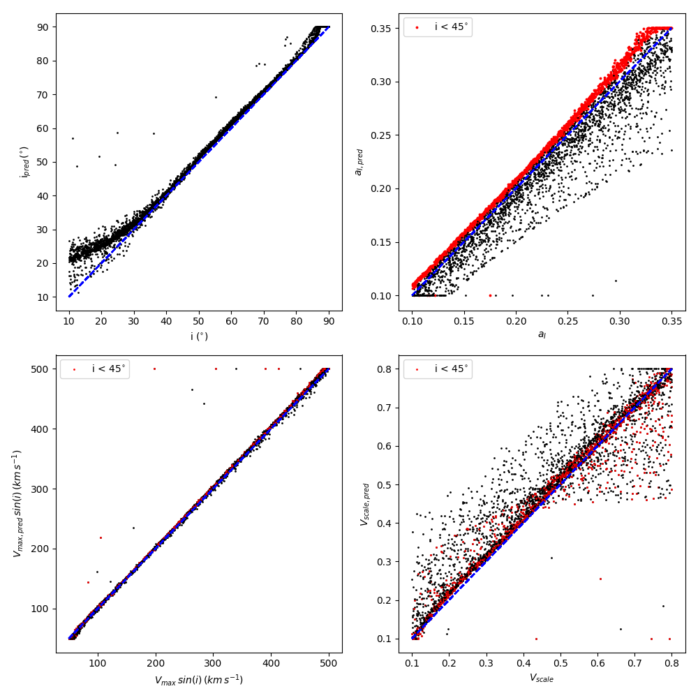
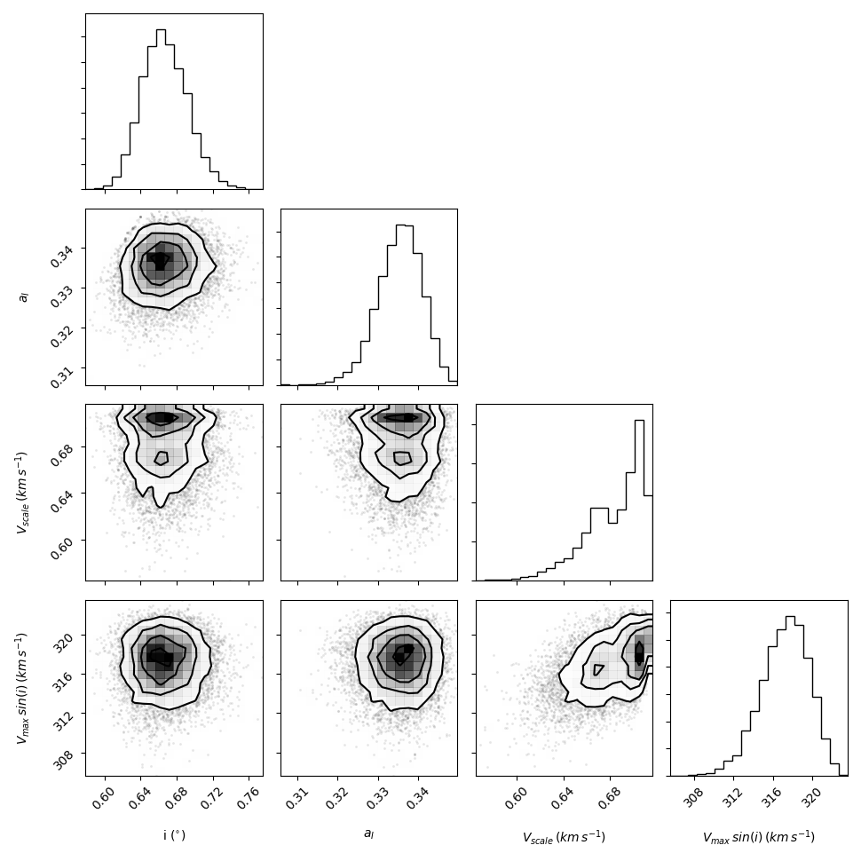

## Kinematic modelling directly from interferometric data cubes in preparation for WALLABY and SKA observations.

---

## Repository breakdown:

All .py files relating to training models can be found in the folder **training_files**. 

Files that are of  most use are:

* training.py - Python file containing the model training procedure calling KinMS.py as the training set creation tool
* model.py - Python file containing the model architecture itself

Background material for understanding the problem we are trying to model can be found in **Collaborative_work**, including a jupyter notebook file explaining the main points entitled **Project_2_outline.ipynb**.

---

## Current results:

We have successfully learned 4 parameters using our self-supervised network. The true vs predicted plots for each are shown in the image below.

We have yet to tighten up the model's predictive accuracy, particularly for the surface brightness and velocity profile scale lengths. 

We have, however, implemented Monte Carlo dropout in order to provide errors over learned parameters and see evidence that the network exhibits little covariance between learned parameters except where we expect to observe them. 

This means we are able to exploit the quasi-Bayseian properties of the model and provide uncertainties of learned parameters in vastly quicker times than currently available for HI fitting routines.  
